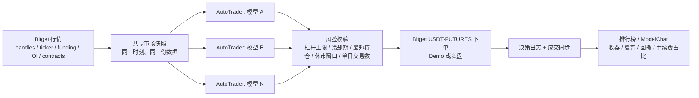

# Alpha Arena 式 LLM 交易系统调研：Bitget（BTC/ETH + TradFi）与 nofx 路线图

> **风险声明**：本文是技术调研与工程规划，**不构成任何投资建议**。带杠杆的实盘交易可能导致本金全部损失，LLM 的决策不具备可靠的盈利保证。任何改动上线前，请先在 Bitget Demo Trading（模拟盘）长时间跑通，再考虑极小资金实盘。
>
> 标注"**待对照官方 v2 文档确认**"的条目是对 Bitget API 行为的推测，实现前必须逐条核实，不应视为定论。文中 `file:line` 引用基于分支 `ccr-859741ef-19y2r9` 当时的代码。

## 目录

1. Alpha Arena 机制拆解
2. GitHub 案例对比
3. 推荐架构（Bitget 单所）
4. nofx 差距清单
5. 路线图（P0–P4）
6. 参考来源

---

## 1. Alpha Arena 机制拆解

### 1.1 Season 1：加密永续

- 每个模型分到相同的 1 万美元本金，在 Hyperliquid 上交易加密永续合约。
- 所有模型使用**同一套 prompt、同一份行情数据**，每隔几分钟决策一次，因此比较的是"模型本身"而不是"数据或工程差异"。
- 模型必须输出结构化 JSON：开仓 / 平仓 / 持有、杠杆倍数、`exit_plan`（止盈、止损、失效条件）以及 `confidence`。
- 官网的 ModelChat 公开每个模型的推理过程，使"为什么这么做"可以被事后审计。

### 1.2 Season 1.5：美股

- 标的换成美股，设四种赛制：**Baseline**、**Monk Mode**（偏保守）、**Situational Awareness**（给更多情境信息）、**Max Leverage**（强制高杠杆）。
- 结果：Grok 4.2 平均收益约 12% 夺冠，GPT-5.1 第二，Gemini 3 第三（见参考来源 [S6]）。
- 这说明同一模型在不同赛制下表现差异很大，赛制本身就是实验变量。

### 1.3 教训

| 问题 | 现象 | 工程对策 |
|---|---|---|
| 过度交易 | 手续费吃掉收益 | 单日最大交易数、冷却期 |
| 杠杆失控 | 例如 Qwen3 曾用 20 倍杠杆做多 BTC | 按资产类别设杠杆上限，代码层硬校验 |
| 无最短持仓 | 反复开平，来回被扫 | 最短持仓时间 |
| 缺少退出纪律 | 只有入场理由，没有失效条件 | schema 强制 `exit_plan` 与 `invalidation_condition` |

核心结论：**LLM 负责提出意图，硬规则必须写在代码里**，不能只靠 prompt 约束。

---

## 2. GitHub 案例对比

### 2.1 加密 Arena 类

| 项目 | 语言 | 市场 / 交易所 | 实盘 / 纸面 | 多模型竞技 | 可借鉴点 |
|---|---|---|---|---|---|
| [nofx](https://github.com/tinkle-community/nofx)（本仓库） | Go | 多所（含 Bitget） | 实盘 + 回测 | 竞技场排行榜、debate 辩论 | 多 LLM、多交易所、`debate/engine.go` |
| [nof0](https://github.com/wquguru/nof0) | 待核实 | 待核实 | 待核实 | 复刻 Alpha Arena | 收录于 awesome 列表 [S7]，细节未逐项核实 |
| [SnowingFox/open-nof1.ai](https://github.com/SnowingFox/open-nof1.ai) | 待核实 | 加密永续 | 待核实 | 开源复刻 | 前端展示与 ModelChat 形态 |
| [HammerGPT/Hyper-Alpha-Arena](https://github.com/HammerGPT/Hyper-Alpha-Arena) | 待核实 | Hyperliquid | 待核实 | 多模型竞技 | 贴近原版赛制 |
| [etrobot/open-alpha-arena](https://github.com/etrobot/open-alpha-arena) | 待核实 | 经 ccxt，纸面交易 | 纸面 | 多模型 | ccxt 同样支持 Bitget，可作纸面交易参考 |
| [Eug-Chua/llm_trading_arena](https://github.com/Eug-Chua/llm_trading_arena) | Python（推测） | 复现 Season 1 | 复盘 | 单次实验 | 复现与归因分析方法 |
| [alpha-arena-okx](https://github.com/oficcejo/alpha-arena-okx) | 待核实 | OKX | 待核实 | DeepSeek / Qwen | 结构最接近"专注单所"的诉求 |

"待核实"表示本次调研未逐个打开仓库确认，仅依据 awesome 列表 [S7] 的收录信息。

### 2.2 股票 / 多 Agent 类

| 项目 | 定位 | 可借鉴点 |
|---|---|---|
| [TauricResearch/TradingAgents](https://github.com/TauricResearch/TradingAgents)（论文 arXiv 2412.20138） | 分析师 → 多空研究员辩论 → 交易员 → 风控 | 角色分工与风控环节 |
| [hsliuping/TradingAgents-CN](https://github.com/hsliuping/TradingAgents-CN) | TradingAgents 中文适配 | 中文数据源与提示词 |
| [virattt/ai-hedge-fund](https://github.com/virattt/ai-hedge-fund) | 多个"投资大师"Agent 的对冲基金示例 | Agent 人设化 |
| [HKUDS/AI-Trader](https://github.com/HKUDS/AI-Trader) | NASDAQ-100 多模型竞技，QQQ 为基准 | 基准曲线、股票场景评测 |
| RockAlpha | 未能在 awesome 列表确认链接 | 仅点名 |
| FinRL / FinRobot | 未能在 awesome 列表确认链接 | 仅点名（金融强化学习 / Agent 框架） |

### 2.3 结论

- Arena 类擅长"同条件对比 + 公开推理过程"。
- TradingAgents 类擅长"多角色深度分析"。
- nofx 两方面都有基础（`debate/engine.go`、竞技场排行榜），短板在**Bitget 适配器质量、TradFi 支持、评测严谨度**。

---

## 3. 推荐架构：Bitget 单所，USDT-FUTURES 统一保证金

### 3.1 标的与产品线

同一个 `USDT-FUTURES` 产品线可覆盖全部目标标的：

- **加密**：BTCUSDT、ETHUSDT，7×24。
- **美股永续**：Bitget 于 2025 年 9 月上线，USDT 本位，30 多只美股，TSLAUSDT、NVDAUSDT 成交最活跃；交易时间 5×24（美东 UTC−4，周一 00:00 至周六 00:00）；头部标的杠杆最高 100 倍，流动性较差的为 10 倍（见 [S1][S2]）。
- **黄金**：Bitget 有黄金 RWA 永续（XAU-USDT 一类），**确切 symbol 需用 `/api/v2/mix/market/contracts` 核对**，本文不假定具体写法。

好处：单一 API、单一 USDT 保证金账户，适配器改动集中在 `trader/bitget_trader.go`。

### 3.2 v2 还是 v3（UTA）

Bitget 提供统一交易账户（UTA）v3 API：`POST /api/v3/trade/place-order` 覆盖所有产品，`productType` 改为 `category`，去掉 `marginCoin` 和单笔订单的 `marginMode`，新增 `posSide` 用于双向持仓；签名方式不变，v2 的 key 可继续使用（见 [S3]）。UTA 把股票与加密的保证金统一起来，长期方向更合理。

**建议**：现在先在 v2 上修好适配器，但把下单、撤单、查询封装在内部 client 接口之后；待 P0 稳定后再规划 v3 迁移，届时只需换接口实现。

### 3.3 数据层

行情改为直接取 Bitget 自有数据，不再借用 Binance：股票永续在 Binance 上不存在，且只有使用 Bitget 自己的标记价、资金费率、持仓量，才能与实际成交价一致。

### 3.4 纸面竞技场

使用 Bitget Demo Trading（v2 请求头 `paptrading: 1`；demo 下 productType 与 symbol 的写法**待对照官方 v2 文档确认**）。每个模型一个 demo 账户或子账户，起始资金相同。

### 3.5 目标架构图

### 3.6 可选设计：规划模型 + 执行模型分层

在公平竞技模式之外，也可以为单个 trader 引入两层模型：

- **规划层（低频，每 1–4 小时）**：强推理模型（如 Claude Opus）判断市场状态（regime）、给出每个持仓的论点（thesis）与 `exit_plan`。
- **执行层（高频，每几分钟）**：更便宜、更快的模型（如 Claude Sonnet）在规划范围内做具体的开 / 平 / 持决策。
- **硬规则层**：二者之间由代码中的风控规则兜底，执行层无法突破规划层与风控设定的边界。

与 nofx 的对应关系：

| 角色 | nofx 落点 |
|---|---|
| 执行模型 | `kernel/engine.go:249` `GetFullDecisionWithStrategy` |
| 规划模型 | `debate/engine.go`，或新增一个 planner 步骤 |
| 模型接入 | `mcp/` 下的客户端已支持 Claude |
| 硬规则 | `kernel/engine.go:1762` `validateDecisions` 及扩展 |

好处是降低成本并减少高频噪声交易；风险是规划与执行不一致，需要把规划结果写入执行层 prompt 并记录日志。该设计是可选项，不属于 P0–P4 的必要范围。

---

## 4. nofx 差距清单

以下所有 Bitget API 行为论断均为"**待对照官方 v2 文档确认**"。

### A. Bitget 适配器 `trader/bitget_trader.go`

**明确未实现（代码事实）**

- `GetOpenOrders` 是 TODO，永远返回空（`:1101`，TODO 在 `:1102`）。
- 无 demo / `paptrading` 支持，构造函数 `NewBitgetTrader(apiKey, secretKey, passphrase)` 没有测试网参数（`:84`）。

**疑似问题（待对照官方 v2 文档确认）**

| 项 | 代码位置 | 疑点 |
|---|---|---|
| SL/TP 接口 | `place-plan-order` + `loss_plan`（`:776`、`:791`），`profit_plan`（`:815`、`:830`） | v2 仓位止盈止损可能应使用 `place-tpsl-order`；撤销时查询的 `planType`（`:857`、`:841`、`:846`）同理 |
| 持仓模式 | `setPositionMode` 设为 `one_way_mode`（`:110`、`:113`） | 账户被强制单向，但 SL/TP 请求带 `tradeSide: close`（`:784`、`:823`），该字段是否适用于单向模式 |
| 保证金模式 | `marginMode: "crossed"` 写死（`:506`、`:560`、`:623`、`:691`、`:779`、`:818`） | 逐仓设置不生效 |
| 先撤后开 | 开仓前先 `CancelAllOrders`（`:493`、`:547`；定义 `:890`），其内部会撤 `loss_plan`/`profit_plan`（`:926`、`:927`） | 会把已有 SL/TP 一并撤掉；下单后未确认成交即返回 |
| 杠杆设置 | `SetLeverage` 失败仅打日志（`:496`–`:498`） | 开仓不中断，实际杠杆可能与预期不符 |
| 数量格式 | `FormatQuantity`（`:940`）按 `VolumePlace` 精度格式化；合约信息获取失败时回退 `%.4f` | 格式化可能向上取整；未使用合约的 `minTradeNum` / `sizeMultiplier`（结构体中有定义，`:388`、`:390`） |
| 已平仓盈亏 | `GetClosedPnL`（`:1016`） | JSON 字段名可能与 v2 不一致，导致字段解析为 0 |

### A2. 订单同步 `trader/bitget_order_sync.go`

- 查询 fill 记录限制 `limit` 最大 100（`:34`–`:37`），同步只取最近 24 小时前 100 条（`:134`–`:140`），无分页。
- 手续费读取 `fee` 字段（`:59`、`:76`），v2 可能把手续费放在 `feeDetail[]` 中（待确认）。
- 动作判断依赖 `tradeSide`（`:86`–`:102`）；单向持仓下该字段取值若不是 open / close，则所有成交都会落到默认的 `open_long`（待确认）。
- 调用 `market.Normalize` 归一化 symbol（`:166`），与下文 xyz 规则冲突。
- 测试：没有任何 Bitget 专属测试，`bitget` 只出现在 `trader/exchange_sync_test.go:193` 的交易所名单里。

### B. 行情与 TradFi

- K 线固定走 CoinAnk 的 Binance 数据（`market/data.go:74`）。
- OI 与资金费率直接请求 `fapi.binance.com`（`market/data.go:754`、`:799`），Bitget 独有标的拿不到数据。
- `xyzDexAssets` 名单（`market/data.go:1019`）配合 `Normalize`（`:1051`）会把 `NVDAUSDT` 归一化为 `xyz:NVDA`，意图是去 Hyperliquid 取价，与 Bitget 冲突；订单同步存储的 symbol 也会被改写。
- 杠杆只有 `BTCETHMaxLeverage` 与 `AltcoinMaxLeverage` 两档（`store/strategy.go:165`、`:167`），没有股票 / 商品档位。
- prompt 示例全是 BTCUSDT（`kernel/engine.go:974`，另见 `kernel/prompt_builder.go`）；`validateDecisions` 只对 BTC/ETH 特判（`kernel/engine.go:1789`、`:1810`）。
- 主循环是固定间隔 ticker（`trader/auto_trader.go:419`），不知道股票永续 5×24 的休市窗口、美股正股开盘状态与财报日。

### C. 回测

- `backtest/datafeed.go:76` 调用 `market.GetKlinesRange`，而 `market/historical.go` 只读 Binance USDT-M 历史 K 线（`fapi.binance.com/fapi/v1/klines`）。
- 没有接入 Bitget 历史 K 线（`/api/v2/mix/market/history-candles`，待确认）。
- 没有 buy & hold 基准。

### D. Arena 评测

- 决策 schema 缺少 `exit_plan`、`invalidation_condition`（现有字段含 `confidence`、`stop_loss`、`take_profit`，见 `kernel/engine.go:974` 示例）。
- 排行榜缺少夏普比率、最大回撤、交易次数、手续费占比。
- 没有"同一时刻、同一份市场快照分发给 N 个模型"的公平模式。
- 没有 Season 1.5 的四种赛制预设。

---

## 5. 路线图

### P0：Bitget 适配器达到可用于生产（含 v2/v3 决策）

- **决策**：先修 v2，同时把下单 / 撤单 / 查询抽成内部 client 接口，P0 之后再规划 v3 UTA 迁移。
- **涉及文件**：`trader/bitget_trader.go`、`trader/bitget_order_sync.go`、`trader/auto_trader.go:233`（工厂）、`manager/trader_manager.go:689`、`api/server.go`（三处构造调用）、`web/src/components/traders/ExchangeConfigModal.tsx`。
- **可复用函数**：`doRequest`、`getContract`、`convertSymbol`、`genBitgetClientOid`；测试参考 `trader/trader_test_suite.go`。
- **工作内容**：逐条对照官方 v2 文档核实第 4 节 A 类疑点并修复；实现 `GetOpenOrders`；增加 demo 开关并贯通构造函数、工厂、前端；开仓后确认成交；SL/TP 改用文档确认的接口；`SetLeverage` 失败时中断。
- **验收标准**：`GetOpenOrders` 返回真实挂单；demo 开关下请求带 `paptrading: 1`；开仓不再误撤已有 SL/TP；`GetClosedPnL` 与 fill 同步在 demo 账户上数值与网页一致。
- **测试方式**：用 `httptest` mock 写单元测试（签名、请求体、各接口解析）；另加一个需手动触发（build tag 或环境变量）的 demo 集成测试。

### P1：Bitget 行情源

- **涉及文件**：新增 `provider/bitget`；`market/data.go`、`market/historical.go`。
- **可复用函数**：`market.Normalize`（需限定仅对 Hyperliquid 生效）、现有 `Kline` 结构。
- **工作内容**：实现 candles、ticker、funding、OI、contracts；`market` 包按交易所选择数据源；`market.Data` 的 OI / funding 允许为空。
- **验收标准**：BTCUSDT、ETHUSDT、NVDAUSDT、TSLAUSDT 和黄金合约都能拿到完整行情；Bitget 模式下不再请求 Binance。
- **测试方式**：`httptest` mock 响应的解析测试；demo 或公开接口的手动冒烟测试。

### P2：TradFi 正确性

- **涉及文件**：`market/data.go`、`store/strategy.go:165`、`kernel/engine.go`、`kernel/prompt_builder.go`、`trader/auto_trader.go:419`。
- **可复用函数**：P1 的 contracts 接口、`validateDecisions`。
- **工作内容**：资产类别由 contracts 接口动态识别；杠杆与 prompt 模板按类别区分；上下文注入交易时段、休市窗口、财报日；休市期间禁止开仓。
- **验收标准**：NVDAUSDT 不再被改写为 `xyz:NVDA`；休市窗口内开仓决策被拒绝；股票类杠杆不超过其独立上限。
- **测试方式**：表驱动单元测试（时区、周末边界）；`validateDecisions` 拒绝用例。

### P3：公平竞技场 + Alpha Arena 特性

- **涉及文件**：`manager/trader_manager.go`、`kernel/engine.go:249`、`kernel/engine.go:1762`、`store/decision.go`、排行榜相关 API 与前端。
- **可复用函数**：`GetFullDecisionWithStrategy`、`validateDecisions`、现有决策日志存储。
- **工作内容**：共享市场快照广播给多个 `AutoTrader`；统一起始资金与标的池（BTC、ETH、NVDA、TSLA、黄金）；schema 增加 `exit_plan`、`invalidation_condition`、`confidence` 并校验；硬约束（冷却期、最短持仓、单日最大交易数）；排行榜补全夏普、最大回撤、交易次数、手续费占比；公开 ModelChat；四种赛制预设；可选的规划 + 执行分层。
- **验收标准**：N 个模型同一周期收到逐字节相同的快照；违反硬约束的决策被拒并记录原因；排行榜指标与手算一致。
- **测试方式**：快照一致性单测；约束用例；用 demo 账户并行跑多个模型一周以上。

### P4：回测

- **涉及文件**：`backtest/datafeed.go:76`、`market/historical.go`。
- **可复用函数**：`GetKlinesRange` 的调用方式、P1 的 Bitget candles。
- **工作内容**：`DataFeed` 支持可插拔数据源，接入 Bitget 历史 K 线；防未来函数检查；基准曲线（BTC、NVDA buy & hold）。
- **验收标准**：同一时间段 Binance 与 Bitget 数据源可切换；回测中任一决策时刻看不到之后的数据；报告含基准对比。
- **测试方式**：构造含"未来泄漏"的数据，断言检查器报错；已知序列下收益与基准的数值回归测试。

---

## 6. 参考来源

- [S1] Bitget 美股永续说明：https://www.bitget.com/support/articles/12560603847519
- [S2] BlockScholes 研究：https://blockscholesresearch.substack.com/p/tokenised-markets-on-bitget-uex-liquidity
- [S3] Bitget UTA API 升级指南：https://www.bitget.com/api-doc/classic/uta-api-upgrade-guide
- [S4] Bitget 官方 v2 合约（mix）API 文档（实现前对照；本次未固定具体链接，请从 Bitget 官方 API 文档站点进入）
- [S5] TradingAgents 论文：https://arxiv.org/abs/2412.20138
- [S6] Alpha Arena Season 1.5 结果：https://forklog.com/en/ai-model-grok-4-2-triumphs-in-trading-tournament/
- [S7] awesome-alpha-arena：https://github.com/kukapay/awesome-alpha-arena

第 2 节的各仓库链接均来自 [S7] 或任务给定的链接；除 nof0 与 alpha-arena-okx 外，其余仓库的语言、实盘 / 纸面等细节本次未逐个打开核实。
